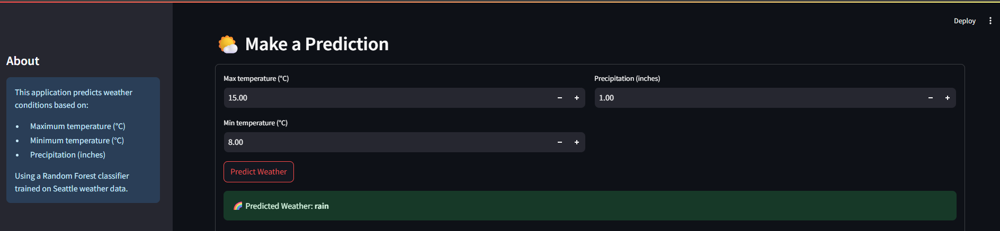
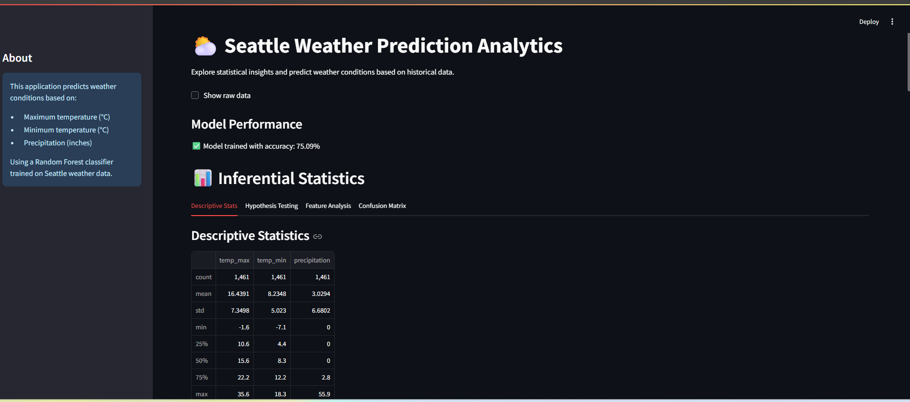

# 🌤️ Seattle Weather Prediction App  

A **Streamlit-based Machine Learning Web App** that predicts weather conditions (☀️ Sun, 🌧️ Rain, ❄️ Snow, 🌫️ Fog, etc.) in Seattle using historical weather data.  
The app provides **real-time predictions**, **statistical analysis**, and **visual insights** to help understand weather patterns.

---

## 🚀 Features  
- Real-time weather prediction using **Random Forest Classifier (75%+ accuracy)**  
- User-friendly **interactive Streamlit UI**  
- **Visual feedback** and prediction confidence scores  
- Integrated **statistical analysis**: T-tests & ANOVA  
- **Feature importance analysis** and correlation heatmaps  

---

## 📂 Project Structure  

| File Name            | Description |
|----------------------|-------------|
| `model.py`           | Streamlit app containing model training, statistical analysis, and UI. |
| `seattle-weather.csv`| Historical Seattle weather dataset used for model training. |
| `Model.ipynb`        | Jupyter notebook for experimentation and model building. |
| `requirements.txt`   | List of required Python libraries. |
| `README.md`          | Project documentation. |
| `LICENSE`            | License information for this project. |

---

## 🧪 Tech Stack  
- **Programming Language:** Python  
- **Frameworks & Libraries:** Streamlit, Scikit-learn, Pandas, NumPy, Matplotlib, Seaborn, SciPy  

---

## 📊 Dataset  
Seattle historical weather dataset containing:
- **Temperature:** Maximum & Minimum  
- **Precipitation:** Rainfall amount  
- **Weather Conditions:** Sun, Rain, Snow, Fog, Drizzle, etc.

**Size:** 1,464 records × 5 features  

---

## ⚙️ Installation & Setup  

1. **Clone the repository**  
   ```bash
   git clone https://github.com/SUJAYBARAI/Seattle-Weather-Prediction.git
   cd Seattle-Weather-Prediction
   ```

2. **Install dependencies**  
   ```bash
   pip install -r requirements.txt
   ```

3. **Run the Streamlit app**  
   ```bash
   streamlit run model.py
   ```

---

## 🖥️ Usage  
1. Enter weather parameters:
   - Maximum Temperature (°C)  
   - Minimum Temperature (°C)  
   - Precipitation (inches)  
2. View:
   - Predicted weather condition  
   - Confidence score with visual feedback  
   - Statistical insights and analysis  

---

## 📸 Demo Screenshot  
_Add a screenshot of your app here_  



🌍 Live Demo
You can try the app here: https://seattle-weather-prediction-hup7rb5bf9mqtyrehdbldh.streamlit.app/

---

## 📜 License  
This project is licensed under the MIT License – see the [LICENSE](LICENSE) file for details.  
